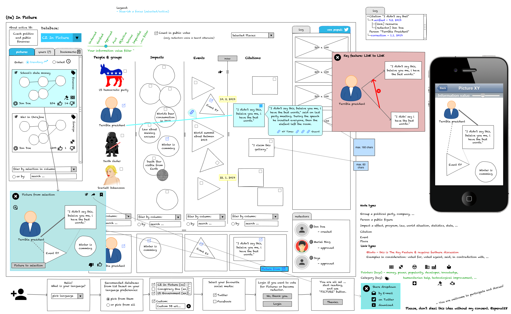

# (Be) In Picture [DRAFT]

- [UI mockup (as PDF)](inPicture.pdf)
- [UI mockup (as Pencil project)](inPicture.epgz)

[Česky](vObraze.md)

## Vision

Motivation: **"One picture can be better than thousands of words..."**

Democratic information network. Like Spotify, but for information. Evolution in information sharing.

Sort of "fact-check" network, where multiple elected redactors has to agree about value of information to be displayed to public eyes.

Initiative to support **independent journalism** and free information to fight against disinformation and **expose connections** between events, citations and political structures.

With love to truth, democracy and freedom with independency and distributed system built in.

Target is not to create new content. Target is to prevent existing content from getting lost from public sight, to be buried under populism and lies. And to be easily found at any time.

Built on trust, independency, freedom of speech and democratic voting.

## be part of this ...

I am open to discussion and suggestions. [Read part "The Plan"](#the-plan)

## 3 cruciral parts

* reader ( end-user application )
* databases ( servers )
* redactors ( unique per server )

## Basic principles

* Every node and link has to be supported by source - exception is adding people and groups.
* Connected to social media by UUID hashtags. _Nothing less, nothing more._
* Every node will be locked in time - to preserve they value that they had in that time.
* Decentralized and democratic system based on voting.
* Every information has to have English translation.
	* This initiative considers English to be universal language, hence all information has to be available in it - with no exception.
	* _(? this is maybe not necessary, maybe even counter-productive ... it is an idea, which is less important)_

## Name

Simple play on words and fact, that graphs are pictures, i think powerful enough. And works in every language.

## The Plan

* Release this draft
* Together with one tweet & Twitter vote poll
* Contact @EdwardSnowden and @JohnOliver
* Contact journalists
* Till and of 2019 decide if this project is worth the work.
* Depends on:
	* @EdwardSnowden aproval
	* and @JohnOliver aproval
	* because i believe in them
* Or/And:
	* on public support
* Till end of 2019 gather needs, opinions, and public discussion
* If everything goes well:
	* I'am willing to
		* make this project reality
		* spend my own resources to do that
		* i do not intent to code it alone
		* publish first version 1.1. 2021

### Public discussion

* [Social media discussion **#BeInPicuture**](https://twitter.com/hashtag/BeInPicture)
* [Post and discuss **Suggestions**](https://github.com/spenat28/inPicture/issues)

## Pahse 0

What is described in this draft.

## Phase 1

More common user features. Like normal account, "mark as read", etc.

## Disclaimer

This application will remain forever free, without adds and without direct sponsor.
It will be community effort to build and maintain its functionality and content.
Every database, server or other connected to this app has to be paid from transparent account as a donation.

## License

Open source - some license suited for what is in disclaimer has to be picked. Apache? GNU-GPL?

## Fun part (databases)

Infinite amount of possibilities, like: Database called **`Conspiracy`** with soul purpose self explained in that name ...

There can be infinite amount of them, which is not target, but possibility.
Target is to have one per each country of the world.

## [Technical concept](inPicture-technical_concept.md)
[Czech version](inPicture-technical_concept--cs.md)

## [Database principles, redactors & board](inPicture-database_redaction.md) (EN version is not ready)
[Czech version](inPicture-database_redaction--cs.md)

## Last word

Today is modern to call disinformation `fake news`. We will call that by its proper name.

> in Czech republic 2019 by @spenat28
