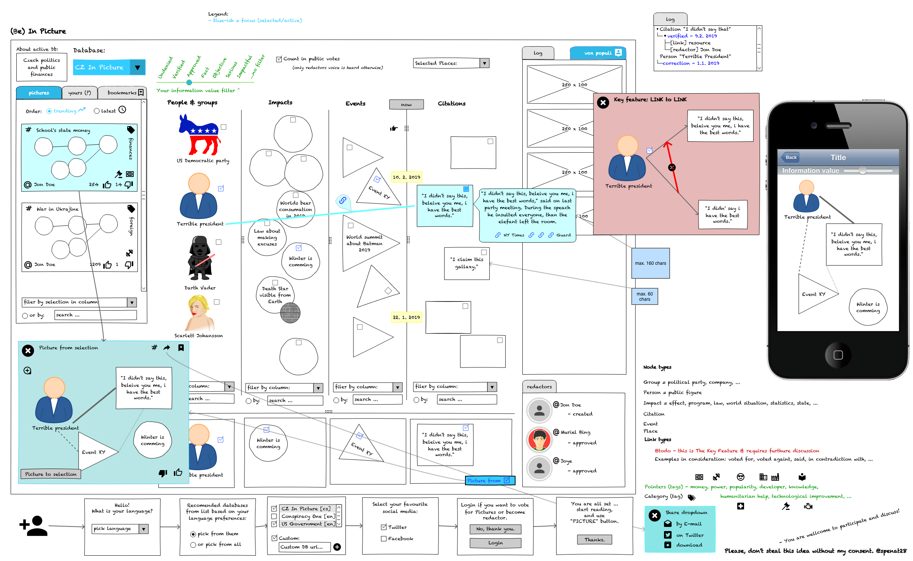

# (Buď) V Obraze [DRAFT]

[PDF - mockup](inPicture.pdf)

[English](index.md)

Většina dokumentace a konceptu je v angličtině. Krátký dokument o projektu (tento) je k dispozici v češtině - pro krátké seznámení by měl stačit.

## Vize

## [Technický koncept](inPicture-technical_concept--cs.md)
[English version](inPicture-technical_concept.md)

## [Databáze, redakce a rada](inPicture-database_redaction--cs.md)
[English version](inPicture-database_redaction.md)

